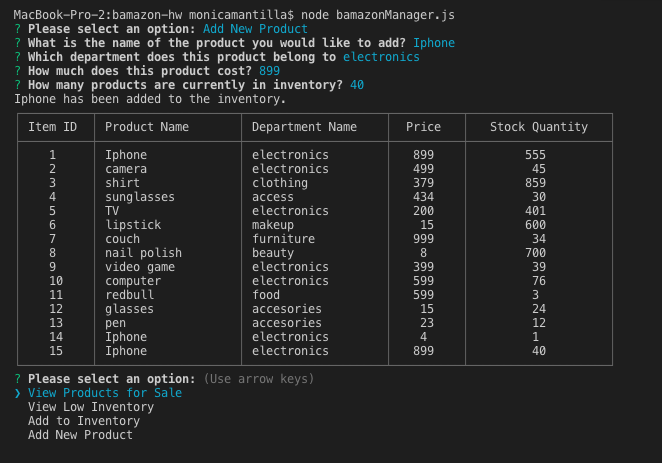

# BAMAZON

## What is BAmazon?
Bamazon is an app that uses MySQL and Node to showcase an inventory of products available. As a customer, the user uses the command line to view the products available, the quanity available, their price, and the department they belong to. The customer has the option to purchase the item. The database will then track the quantity left in stock. 

As a manager, the user has the ability to view the products for sale and view the items that are low in inventory. The user then has the option to add to the inventory and even add a new product. 

In the future, the app will have the functionality for the supervisor to track inventory and sales. 

### Demo:
<!-- Customer View -->

<!-- Manager View All Products-->

<!-- Manager View Low Inventory-->

<!-- Manager Add To Inventory-->

<!-- Manager Add New Product-->

